# NETIAGATE

#### tl;dr Netia oszukuje: dekodery Netii (na pewno N7700 i N7800) nie przechodzą w stan uśpienia (standby) mimo zapalonej czerwonej diody i powołania się na rozporządzenia w deklaracji zgodności. Roczne straty wszystkich użytkowników mogą przekraczać 7,5 mln zł.

### 1. Jak się to zaczęło?
Przypadkiem. Nieużywany od kilku godzin dekoder ciągle był wyraźnie ciepły. Dziwna sprawa, postanowiłem sprawdzić temperaturę po kolejnych kilku godzinach. Dalej to samo.
W tym momencie ruch poszedł najzwyklejszy termometr. Temperatura wskazywana przez termometr leżący na dekoderze wskazywała ponad 31 stopni. Temperatura otoczenia to 21 stopni. Podczas oglądania TV temperatura dekodera wynosi ok 36 stopni.
W przeciwieństwie do pomiaru prądu, pomiar temperatury nie wymagał praktycznie żadnych przygotowań, był szybki i bezobsługowy.
Znacznie dokładniejszy jest pomiar prądu - powierdził że dekoder "nie zasypia".

### 2. Rozporządzenia 1275/2008 i 107/2009
W przypadku obu dekoderów (N7700, N7800) z którymi miałem do czynienia, Netia chwali się zawsze niskim zużyciem energii elektrycznej w stanie czuwania wynoszącym ok 0,5 W. Wartość ta jest zgodna z rozporządzeniem [1275/2008](https://eur-lex.europa.eu/eli/reg/2008/1275/oj?locale=pl) oraz [107/2009](https://eur-lex.europa.eu/eli/reg/2009/107/oj?locale=pl).

Netia Player 1.5 (N7700)
- [https://my.netia.pl/pr/280310/nowa-wersja-netia-playera](https://my.netia.pl/pr/280310/nowa-wersja-netia-playera) ([Kopie strony](https://web.archive.org/web/20240301000000*/https://my.netia.pl/pr/280310/nowa-wersja-netia-playera))
- [https://my.netia.pl/aktualnosci-i-opinie/280348/nowy-netia-player-mniejszy-ale-duzo-mocniejszy](https://my.netia.pl/aktualnosci-i-opinie/280348/nowy-netia-player-mniejszy-ale-duzo-mocniejszy) ([Kopie strony](https://web.archive.org/web/20240301000000*/https://my.netia.pl/aktualnosci-i-opinie/280348/nowy-netia-player-mniejszy-ale-duzo-mocniejszy))

Netia Player 2.0 (N7800)
- [https://my.netia.pl/pr/348521/netia-player-w-nowej-odslonie](https://my.netia.pl/pr/348521/netia-player-w-nowej-odslonie) ([Kopie strony](https://web.archive.org/web/20240301000000*/https://my.netia.pl/pr/348521/netia-player-w-nowej-odslonie))

Wszystko byłoby w porządku, gdyby dekodery "zasypiały" a nie tylko zmieniały kolor diody z zielonej na czerwoną.

Wybrane definicje z rozporządzeń:

```
2) „tryb(-y) czuwania” oznacza(-ją) stan, gdy urządzenie jest podłączone do sieci zasilania elektrycznego, musi pobierać energię z sieci zasilania elektrycznego, aby działać zgodnie z przeznaczeniem oraz wykonuje tylko poniższe funkcje przez dowolnie długi czas:
— sama funkcja ponownego włączenia lub funkcja ponownego włączenia jedynie ze wskazaniem aktywowania funkcji ponownego włączenia, lub/oraz
— wyświetlanie informacji lub statusu;

3) „funkcja ponownego włączenia” oznacza funkcję umożliwiającą włączanie innych trybów, w tym trybu aktywnego, przez zdalnie sterowany przełącznik, jak np. urządzenie zdalnego sterowania, czujnik wewnętrzny lub licznik czasu służący do przełączenia w tryb, w którym dostępne są dodatkowe funkcje urządzenia, w tym jego główna funkcja;

4) „wyświetlanie informacji lub statusu” oznacza stale włączoną funkcję wyświetlania na wyświetlaczu informacji lub wskazywania statusu urządzenia, w tym zegary;
```

### 3. Zgłoszenia do operatora
Pierwsze próby zgłoszenia problemu były w marcu 2024. Za każdym razem odpowiedź była w stylu "wszystko jest w porządku", "tak ma być".
Ponieważ kontakty przez Netia Online nie przyniosły skutku, napisałem reklamcje. Odpowiedzi były identyczne, a reklamacje - rozpatrywane negatywnie.
Prosiłem o bezpośredni kontakt w celu zgłoszenia problemu - nie otrzymałem.
Nie uzyskałem również odpowiedzi na prośby o przekazanie pomiarów Netii.
W odpowiedzi na ostatnią reklamację z dnia 2024-05-23, przekazano tylko:  

`"W związku ze zgłoszonymi przez Pana problemami, skierowaliśmy sprawę do odpowiedniego działu, gdzie zostaną zweryfikowane poruszone przez Pana kwestie."`

Odpowiedź "Odpowiedniego działu":

`"W odpowiedzi na zgłoszenie informuję, że zweryfikowałam Pana sprawę. Wyjaśniam, że nie stwierdziliśmy nieprawidłowości w działaniu przekazanego Panu urządzenia. Jednocześnie wyjaśniam, że poruszony przez Pana temat podlegał wewnętrznej weryfikacji przez odpowiedni Dział w naszej firmie."`

W tym momencie odpuściłem kontakty z operatorem, szkoda czasu i nerwów. Chyba jedynym sposobem nagannych praktyk operatora jest nagłośnienie sprawy.

### 4. Co robisz skoro nie śpisz?
Ponieważ aktualnie posiadam wersję N7700, poniższe informacje dotyczą właśnie tej wersji. W stanie uśpienia, w dekoderze aktywne są wszystkie wyjścia/porty. Dzięki aktywności portu sieciowego możliwe jest sprawdzenie komunikacji sieciowej.

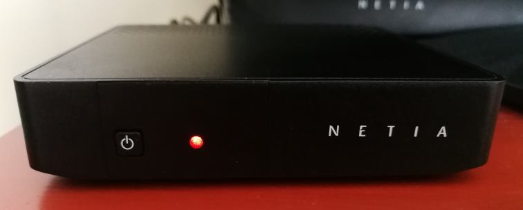<br>
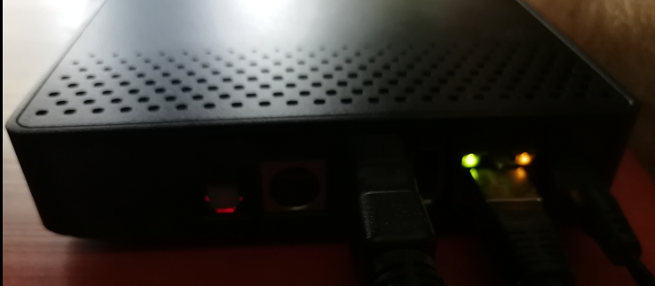

#### Otwarte porty dekodera N7700

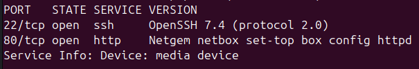

#### Intensywna komunikacja sieciowa w trybie uśpienia

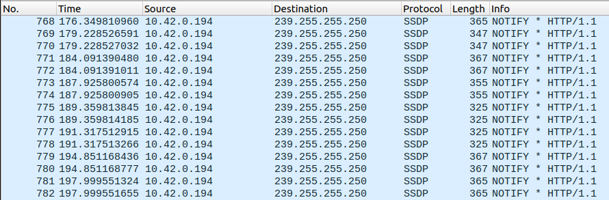<br>

Szczegóy komunikacji [SSDP](https://en.wikipedia.org/wiki/Simple_Service_Discovery_Protocol):

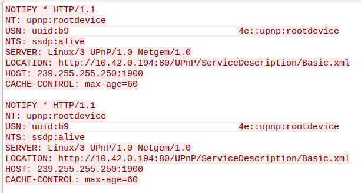

#### Dostęp przez WWW

Z dekoderem **w stanie uśpienia** można się połączyć za pomocą przeglądarki internetowej uzyskując sporo informacji.

Wyświetlenie stanu dekodera:

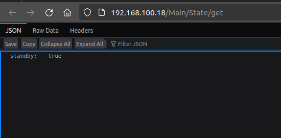<br>

Wyświetlenie listy aplikacji:

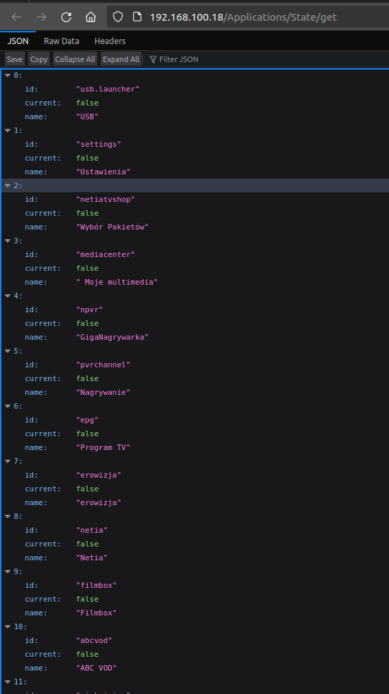<br>

Wyświetlenie aktywnego kanału:

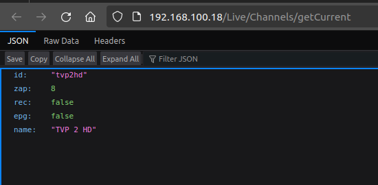<br>

Wyświetlenie listy kanałów:

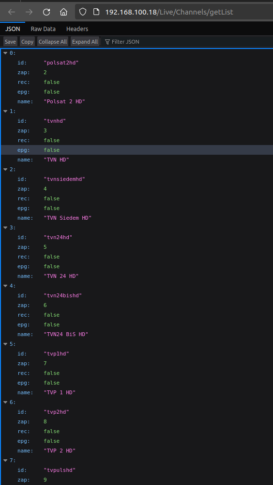<br>

Wyświetlenie poziomu głośności:

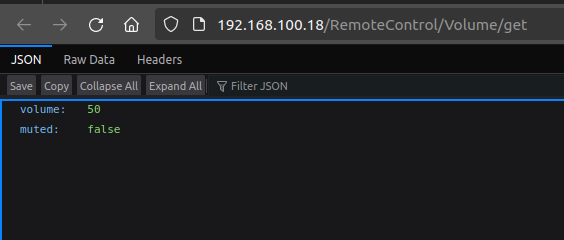<br>

Wersja oprogramowania dekodera

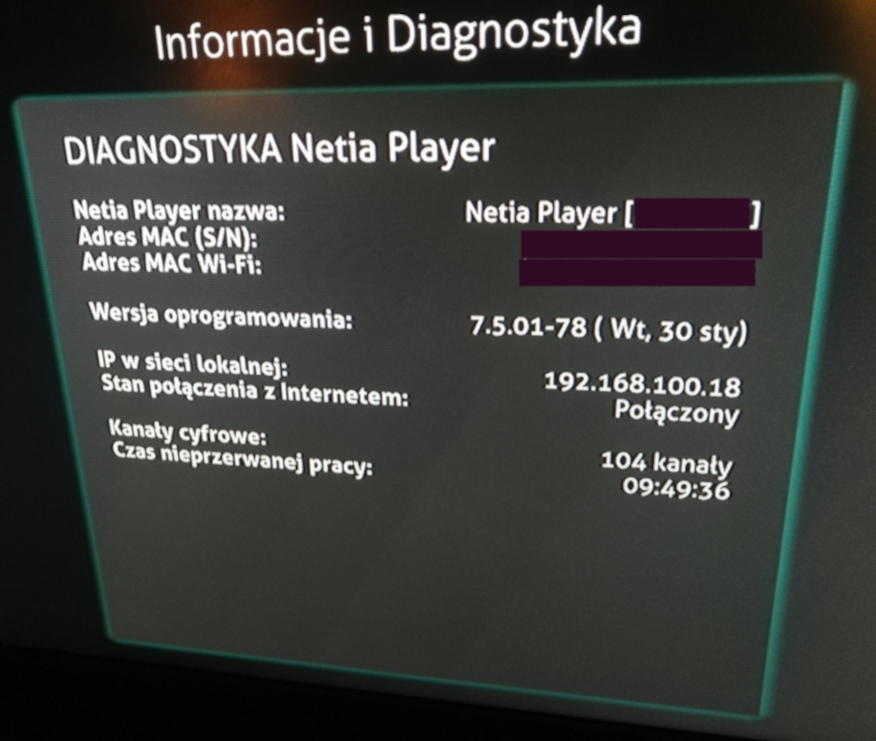<br>

Już na powyższych przykładach wyraźnie widać, że dekoder nie spełnia wymagań trybu czuwania zacytowanego powyżej. Proszę zwrócić uwagę na czas nieprzerwanej pracy. Netia nawet nie ukrywa, że dekoder ciągle "pracuje" (noc w trybie standby).

W celu przetestowania własnego dekodera, można skorzystać z przygotowanej strony dostępnej [tutaj](https://github.com/NetiaGate/NetiaGate.github.io/raw/master/N7700_linki.htm). Pobierz plik oraz otwórz w przeglądarce internetowej.

Więcej informacji na temat sterowania dekoderem można znaleźć na poniższych stronach:  
[https://github.com/korasinski/pyNetia](https://github.com/korasinski/pyNetia)  
[https://github.com/korasinski/ha-netia](https://github.com/korasinski/ha-netia)  
[https://github.com/pawcik/NetiaRemote](https://github.com/pawcik/NetiaRemote)

### 5. Pomiary

Celem pomiarów nie jest idealny pomiar zużycia enerii elektrycznej, a udowodnienie, że dekoder nie przechodzi do stanu uśpienia.
Pomiar zużycia energii został przeprowadzony urządzeniem ORNO OR-WAT-435. Zasilacz niepodłączony do dekodera zużywa na tyle mało energii, że wynik jest zerowy.
Dekoder jest podłączony do Internetu za pomocą kabla sieciowego. Połączenie z TV kablem HDMI.

| Tylko zasilacz | Standby | Włączony | Standby/Włączony |
|:-:|:-:|:-:|:-:|
| 0 W | 3,6 W | 4,8 W | 0,75 |

Pomiar prądu stałego za zasilaczem innym miernikiem potwierdził poprawność pomiaru urządzeniem ORNO. W tym przypadku stosunek Standby/Włączony wynosi 0,78

Wnioski z pomiarów:  
urządzenie w stanie uśpienia zużywa aż 3/4 energii jaką dekoder pobiera podczas pracy czyli odtwarzania TV w jakości HD! Dopuszczalna moc w tym stanie jest przekroczona ponad 7 razy!

### 6. Koszty

Założenia:
- dekoder podpięty całą dobę do zasilania
- dobowy czas oglądania TV: 5 godz.
- dobowy czas w stanie uśpienia: 19 godz.
- koszt 1 kWh: 1 zł (dla uproszczenia obliczeń)
- maksymalny dopuszczalny pobór mocy w stanie uśpienia (wg Netii, rozporządzenia [1275/2008](https://eur-lex.europa.eu/eli/reg/2008/1275/oj?locale=pl) i [107/2009](https://eur-lex.europa.eu/eli/reg/2009/107/oj?locale=pl)): 0,5 W
- abonenci TV Netii [wg stanu na 09/2023](https://www.wirtualnemedia.pl/artykul/lista-kanalow-netia-polsat-box-netia-go-plus-telewizja-disney-rebranding): 350 000

Koszt nadmiarowego zużycia energii w stanie czuwania dla wszystkich abonentow wg stanu na 09/2023 (aktualnie będzie znacznie więcej):

| Okres | Zużycie [kWh] | Koszt [zł] |
|:-:|:-:|:-:|
| Doba | 20 615 | 20 615 |
| Miesiąc | 618 450 | 618 450 |
| Rok | 7 521 975 | 7 521 975 |

Podsumowując:  
Wszyscy abonenci TV w Netii mogą tracić rocznie ponad 7,5 miliona złotych tylko dlatego, że urządzenia nie działają poprawnie!
Nie wiadomo jak długo już trwa to oszustwo, zapewne od momentu wprowadzenia urządzeń na rynek.  
Co roku bezpowrotnie marnowane jest grubo ponad 7,5 GWh energii elektrycznej. Gdzie w tym wszystkim jest ekologia? Gdzie są instytucje zajmujące się kontrolą urządzeń?

Na sam koniec należy podkreślić, że nie przeprowadzałem żadnych ingerencji w oprogramowanie ani nie otwierałem obudowy dekodera.

### 7. Załączniki

Pobór w stanie czuwania

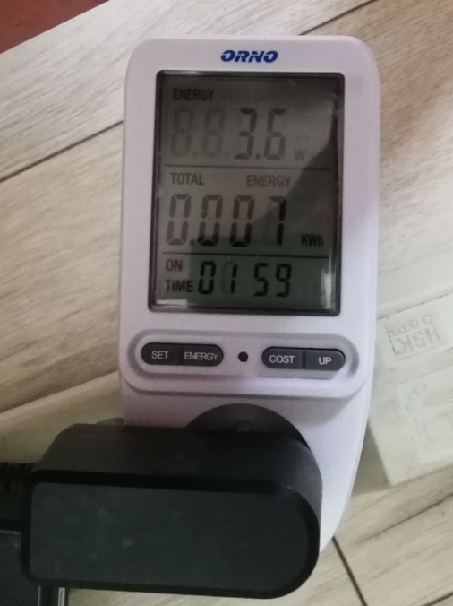<br>

Pobór w stanie oglądania TV

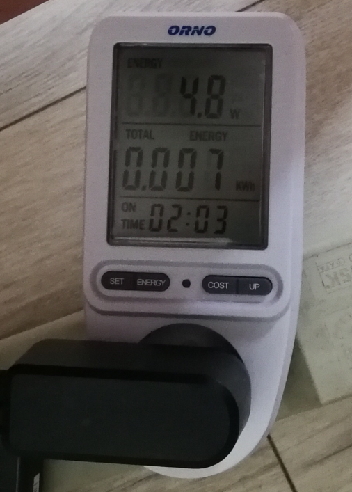<br>

Dołączona deklaracja zgodności

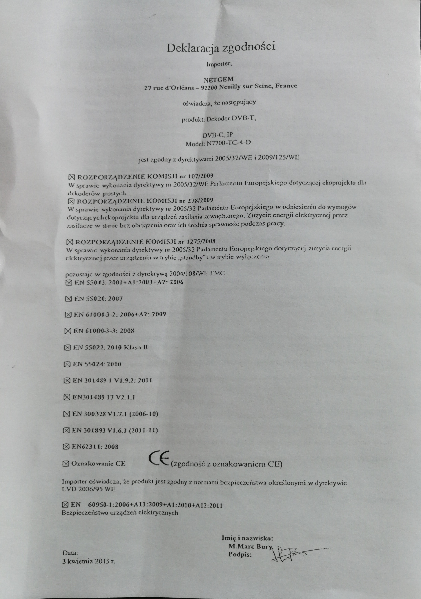<br>

## Aktualizacje strony

### Aktualizacja 1
Poprawki kosmetyczne, poprawa linków

### Aktualizacja 2
W dniu 03.09.2024 sprawa zgłoszona do UOKiK
